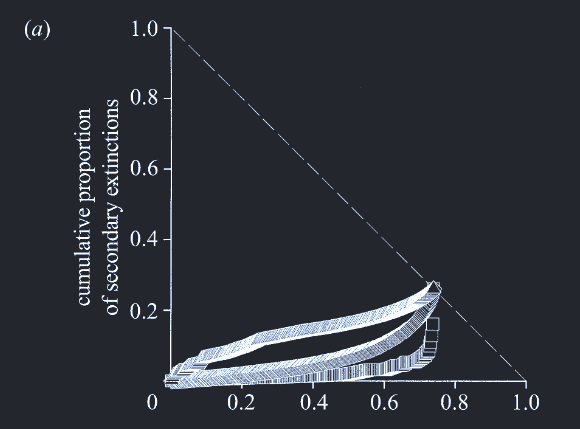

```{r setup, include=FALSE}
knitr::opts_chunk$set(echo = TRUE)
```

second.extinct calculates the consequences of removing a species from a bipartite network. With plotting and slope-estimation functionality.
Details: The procedure of this function is simple. For example imagine the web to represent a pollination web, in which pollinators die one by one. Set all entries of a column to zero, see how may rows are now also all-zero (i.e. species that are now not pollinated any more), and count these as secondary extinctions of the primary exterminated pollinator.

Internally, each extermination is achieved by a call to extinction, followed by a call to empty, which counts the number of all-zero columns and rows.

Although written for pollination webs (hence the nomenclature of pollinator and plant), it can be similarly applied to other types of bipartite networks. It is called by networklevel.
Usage: second.extinct(web, participant = "higher", method = "abun", nrep = 10, details = FALSE, ext.row=NULL, ext.col=NULL)

Arguments:
  method: Random deletion of a species (random); according to its abundance, with least abundant going extinct first (abundance; default) or "degree" to build a sequence from the best-to-least connected species. This is the most extreme case, where the most generalist species goes extinct first (see Memmott et al. 1998). (Note that method="abundance" does not work with participant="both"; in this case a random sequence of species from both trophic levels is generated.) external will use the externally provided vector to determine extinction sequence.
  ext.row: Optional vector giving the sequence in which lower-level species are to be deleted.
  ext.col: Optional vector giving the sequence in which higher-level species are to be deleted.
  
Note: networklevel calls second.extinct; extinction and empty are internal helper functions, and slope.bipartite calculates extinction slopes from the output of second.extinct.

```{r second.extinct}
?second.extinct

```

bipartite function "networklevel" gives outputs:
 $‘extinction slope lower trophic level‘ [1] 2.286152 
 $‘extinction slope higher trophic level‘ [1] 2.9211

Extinction slopes are hyperbolic fits to a simulated extinction sequence of the network, which causes secondary extinctions in the other trophic level (from Memmott 2004).

slope.bipartite fits a hyperbolic function to the extinction simulation of "second.extinct."
This function scales extinction sequences to values between 0 and 1 for each participant. 
The x-axis of the graph features the proportion of exterminated participants, while the y-axis depicts the proportion of secondary extinctions. Since these curves usually follow a hyperbolic function (see examples in Memmott et al. 2004), this is fitted to the data.

```{r slope.bipartite}
?slope.bipartite
```


```{r echo=FALSE, out.width='50%', fig.align='center'}

```
Examples

```{r second.extinct.examples}
## Not run: 
data(Safariland)
(ex <- second.extinct(Safariland, participant="lower", method="random", nrep=50, 
	details=TRUE))
(ex <- second.extinct(Safariland, participant="higher", method="abundance", nrep=50, 
	details=FALSE))

## End(Not run)
```


